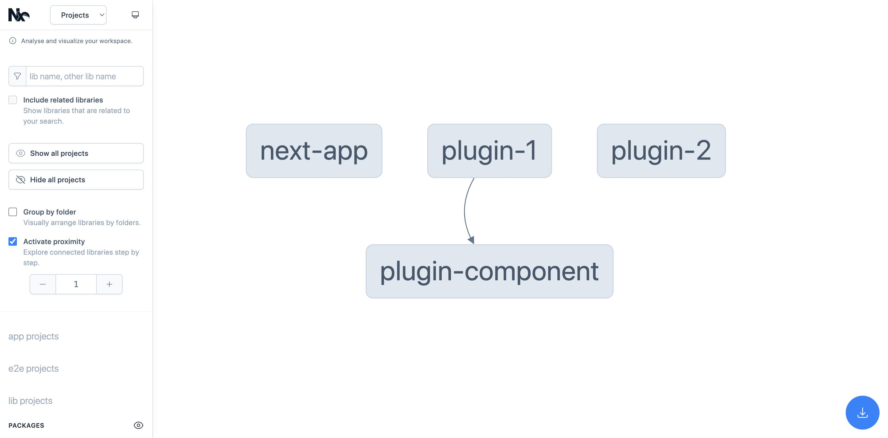

# Monorepo React Template

基于 Lerna 的单一存储库示例，它创建了一个用于管理和发布多个包的现代构建系统。

---

- [English](README.md)
- [中文](README_CN.md)

---


.


## File Structures


```sh
monorepo-react-template/
├── README.md
├── LICENSE
├── lerna.json  
├── nx.json
├── package.json
├── packages/ 
│   ├── front-end/     ------------------------- (基于nextjs, 应该进入此目录单独编译它)
│   ├── plugin-component/  --------------------- (使用 TypeScript 编译)
│   ├── plugin-1/   ---------------------------- (依赖于 `plugin-component`)
│   ├── plugin-2/   ---------------------------- (使用 `react-scripts` 命令)
│   └── .../
└──
```


## 入门

确保您的计算机上是否安装了 Node 14+.

### 第1步：通过运行以下命令创建一个新的 Lerna 工作空间：

```sh
$ cd /{your_directory}/monorepo-react-template
$ npx lerna init
```


### 第2步：安装依赖

```sh
$ npm install
```
 

### 第3步：要打开可视化效果，请运行：

```sh
$ npx nx graph
```
 
### 第4步：要构建所有项目，请运行

```sh
$ lerna run build
```

或者构建你想要的包（推荐使用此命令）：

```sh
$ lerna run build --scope=plugin-1 --scope=plugin-2 --scope=plugin-component
```


<blockquote>
<h3>⚠️ 提示1</h3>

确保 `packages/plugin-component` 已经被复制到 `node_modules` 目录中, 因为 `packages/plugin-1` 依赖于 `packages/plugin-component`.


<h3>⚠️ 提示2</h3>

`packages/` 目录中的项目不应该包含 `node_modules/` 文件夹。

packages中项目的 scripts 配置需要支持全局的，比如不存在 `react-scripts` 命令。 您需要先全局安装它。 其他命令也是如此。


```sh
$ sudo npm install --g react-scripts
```

同理:

```sh
$ sudo npm install --g webpack webpack-cli
```

<h3>⚠️ 提示3</h3>

除 `packages/front-end` 外的其它 packages 内的项目依赖项应该在根目录的 package.json 文件中配置。


</blockquote>

 
 ---

更多的命令请参考 [Here](https://lerna.js.org/docs/getting-started).


## 感谢

- [Lerna](https://github.com/lerna/lerna)


## 许可证

Licensed under the [MIT](https://opensource.org/licenses/MIT).

